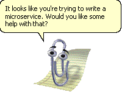
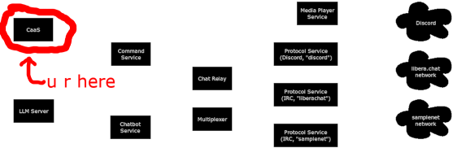

# CaaS ("Clippy as a Service")

win32 microservice used by my chat bot. targets .NET FX 4.0.

said bot was originally written in C#, but completely rewritten in typescript later. some features i previously had or want to add are annoying to port/implement on node+linux.

all this application does is host a tiny HTTP server with a few endpoints for generating content. all endpoints take POST requests with plaintext bodies. it does a lot of things synchronously, so i can assure you it absolutely will not scale well.

the only thing currently really of note for most people is the clippy generator, which was written by my good friend Toxoid49b out of pity back in the day because mine was so bad.

current features:
- `/clippy` clippy image generator
- `/dectalk` say.exe wrapper (you need to have say.exe in `(app root)/bin/say.exe`)

